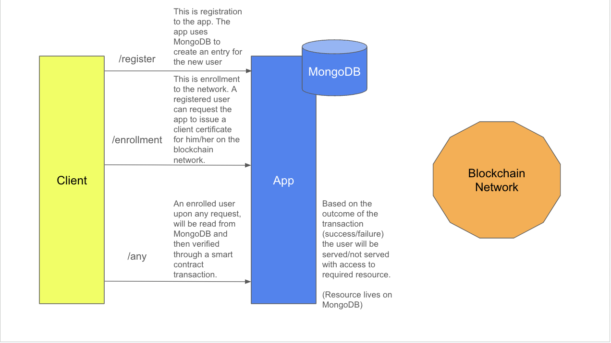

# Blockchain Integration Roadmap

## Integration map

## First Steps Toward Integration (Recommended)

Before proceeding with the more technical steps for integration, there are two critical issues that should be addressed first:

1. **Repository Merge (Fabric & BlockchainService)**  
   There is a lot of overlapping code between the two repositories (Fabric and BlockchainService), and I believe there is no need for them to remain distinct. Keeping them separate only adds unnecessary complexity and confusion, especially in a project that is already quite complex. Merging these repositories would streamline development, reduce redundancy, and simplify maintenance moving forward.

2. **Code Cleanup**  
   While refactoring may not be necessary at this point, the codebase is due for delivery at the next consortium meeting. There is a significant amount of dead code, outdated comments, broken links, and other issues that need to be cleaned up. This task should be approached with care and attention to detail to avoid any unintended side effects that could break functionality. It’s a delicate task that requires a thorough review, as rushing through it could introduce new issues.

After addressing these foundational issues, we can move on to the next steps, which will focus on the more technical aspects of the blockchain integration.

## Next Steps

The current setup is centralized, with all user data stored in MongoDB, and all requested transactions being generated by the TypeScript application. This setup is relatively straightforward and can be completed, but it's not fully implemented yet—specifically, registration and enrollment are buggy and need to be fixed.

### Transition to Decentralized Setup

To move toward a decentralized architecture, several key changes must be implemented:

1. **Hyperledger Fabric Certificate Storage in Client Systems**  
   The current system stores certificates centrally, but for decentralization, Hyperledger Fabric certificate storage must be moved to the client system (likely the operating system, as browser storage seems impractical). The feasibility of this approach is still unclear, and further exploration is needed to determine how this can be implemented or if it’s even possible.

2. **Transaction Building on the Client Side**  
   In the decentralized setup, the client app should build transactions. This requires at least partial knowledge of the smart contract functionality. One potential solution is to offer a list of pre-built transaction choices for the client app. However, this needs further investigation to determine the best approach.

3. **Client Certificates on the Network**  
   Hyperledger Fabric theoretically supports client certificates on the network, but as of now, no working code has been developed to issue them. Implementing this should be relatively simple, but it’s crucial to handle this carefully. Fabric is a sensitive framework, and any changes that impact block data require extra caution to avoid unintended consequences.

## Goal of This Roadmap

The primary goal of this roadmap is to transition the current centralized setup to a more decentralized architecture. The first objective is to complete the centralized setup by addressing and resolving all bugs and inconsistencies in the API requests, particularly those related to registration and enrollment.

Once the centralized setup is stable, the aim is to gradually reduce the TypeScript app’s role in managing network transactions. Specifically, the TypeScript app’s functionality should be downgraded from managing transactions to acting as a gateway. In this new setup:

- **Certificates** will be stored on the client-side.
- **Blockchain network transactions** will be built and signed within the client app.
- The TypeScript app will be responsible solely for **verifying user registration** to protect against DoS attacks and for **sending transactions to the Hyperledger Fabric peers** for processing.

This transition will enhance the security, scalability, and decentralization of the system, while ensuring the app remains efficient and secure.
